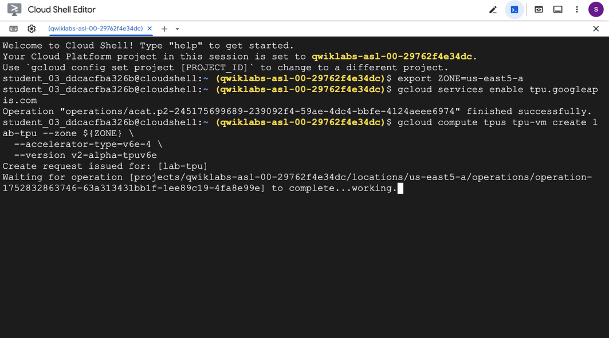
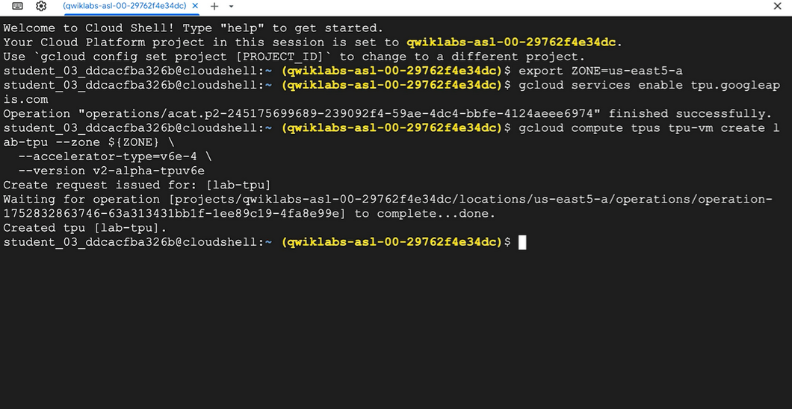
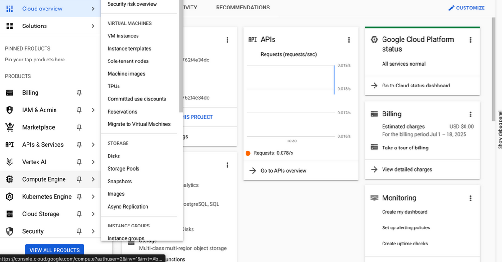
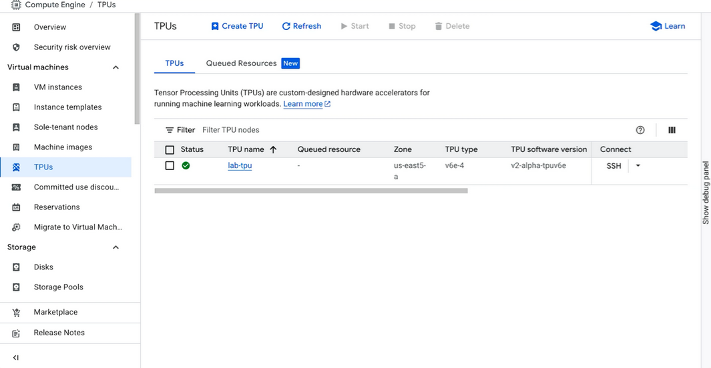
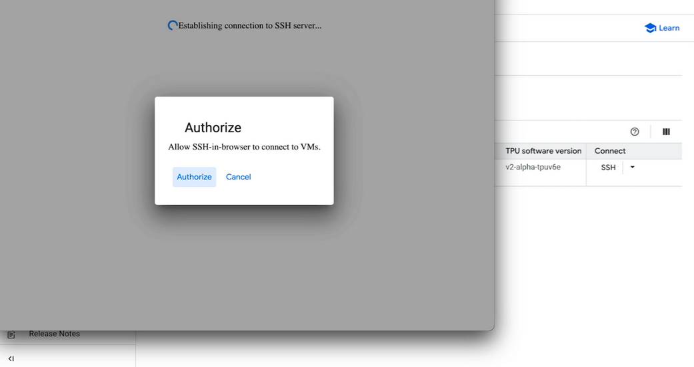
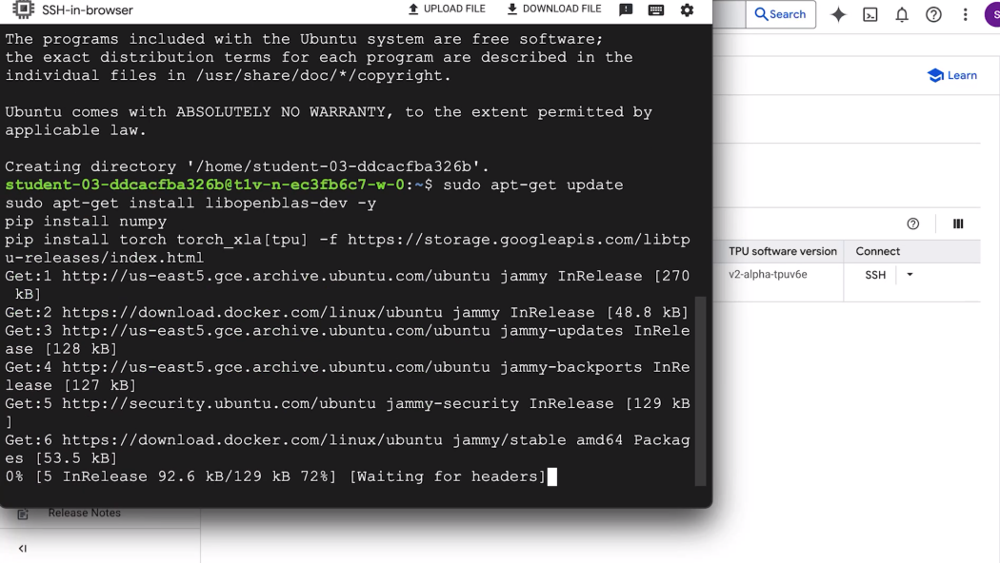
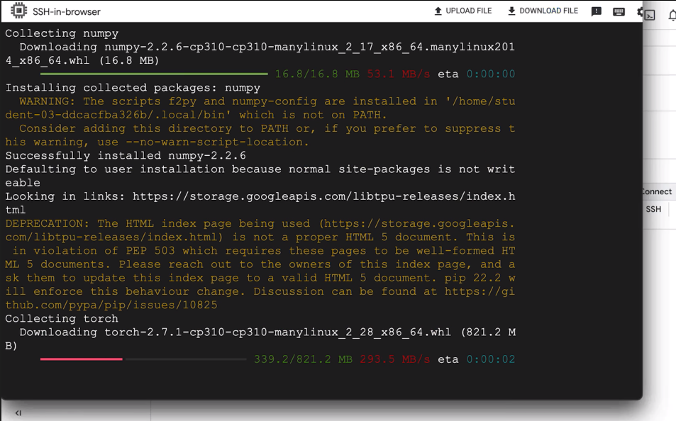
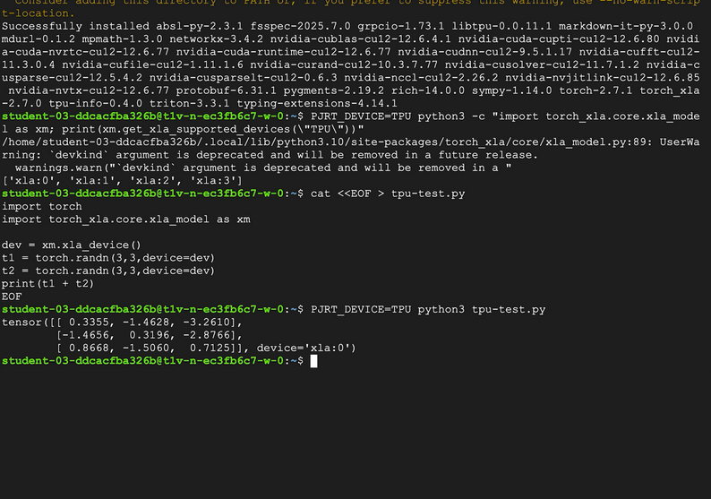

# tpu1 🔢🧠🖼️
tpu1 : Tensor Processing Unit Demo # TPU # PyTorch # XLA # Google

## Objective
- Create a Tensor Processing Unit (TPU) Virtual Machine (VM)
- Connect to the TPU over Secure Shell (SSH)
- Install PyTorch/XLA on the TPU
- Perform a basic calculation on the TPU VM using PyTorch

## TPU Simulation Demo

